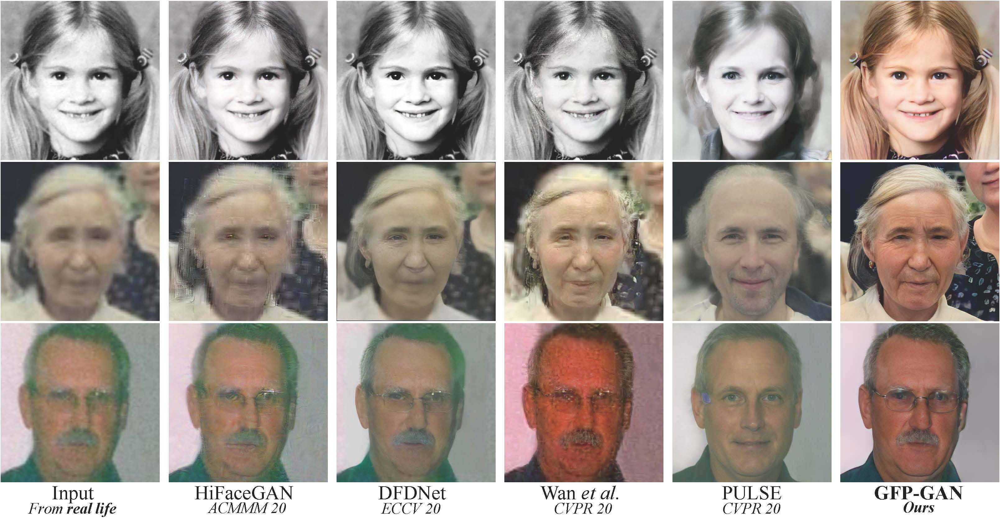
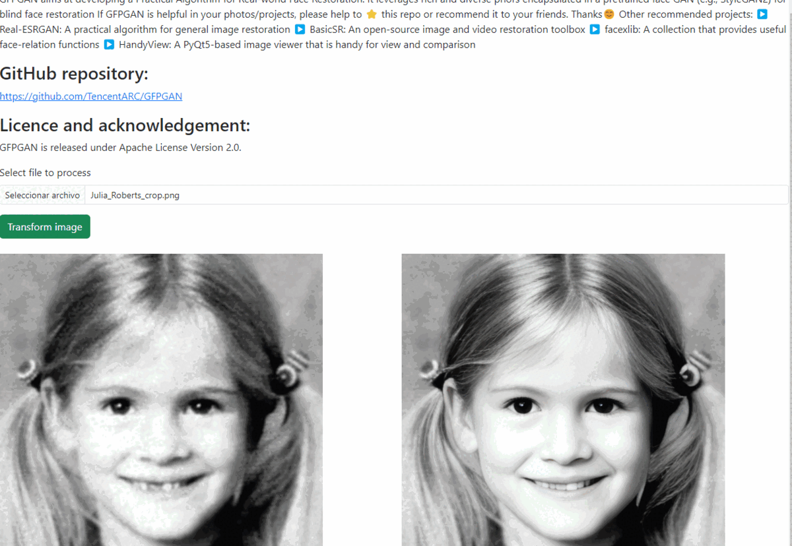

##  GFP-GAN: Towards Real-World Blind Face Restoration with Generative Facial Prior


This project is an adaptation of original project GFP-GAN: Towards Real-World Blind Face Restoration with Generative Facial Prior

Original project:
https://github.com/TencentARC/GFPGAN





## Process to execute this project

> This project was created using python 3.8.10

> - Step 1: Clone this project, using: 
>```
> git clone https://github.com/EdFlo15/face-restoration-with-GAN.git
>```
> - Step 2: Enter into folder: face-restoration-with-GAN
>```
> cd face-restoration-with-GAN
>```
> - Step 3: go to the original project https://github.com/TencentARC/GFPGAN/tree/master and download gfpgan folder
>```
>Add the folder gfpgan inside of face-restoration-with-GAN. 
>This folder is needed to make restoration.
>```
>- Step 4: Create virtual environment using version of python 3.8.10.
>```
> python3 -m venv venv/
>```
>- Step 5: Activate the virtual environment
>```
>  source venv/bin/activate
>```
>- Step 6: install the libraries
>```
>  pip install -r requirements.txt
>```
>- Step 7: Launch the application
>```
>  uvicorn app:app --reload
>```
>- Step 8: Get the project to test the API through:
>```
>  http://localhost:8000/docs
>```
>- Step 9: Consume the api from angular or react, below is show the services component only:
>```
>import { Injectable } from '@angular/core';
>import { HttpClient } from '@angular/common/http';
>@Injectable({
>  providedIn: 'root'
>})
>export class GetImageServicesService {
>  private apiUrl = 'http://localhost:8000'; // FastAPI backend URL
>  constructor(private http: HttpClient) { }
>
>  getImage() {
>    return this.http.get(`${this.apiUrl}/get_image`, { responseType: 'blob' });
>  }
>}

All the images is save in project's results folder


## Test





## Other test

All the images is save in results folder


